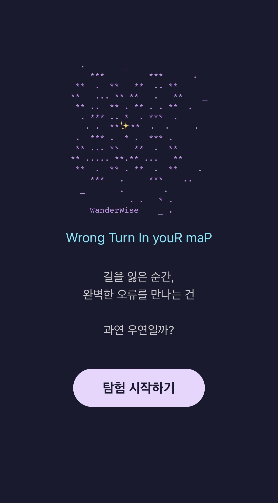
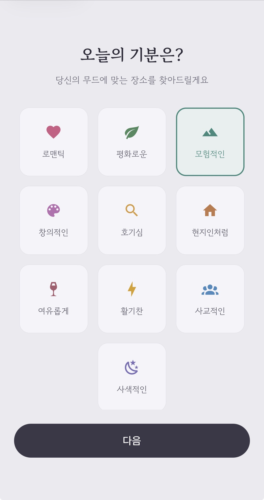
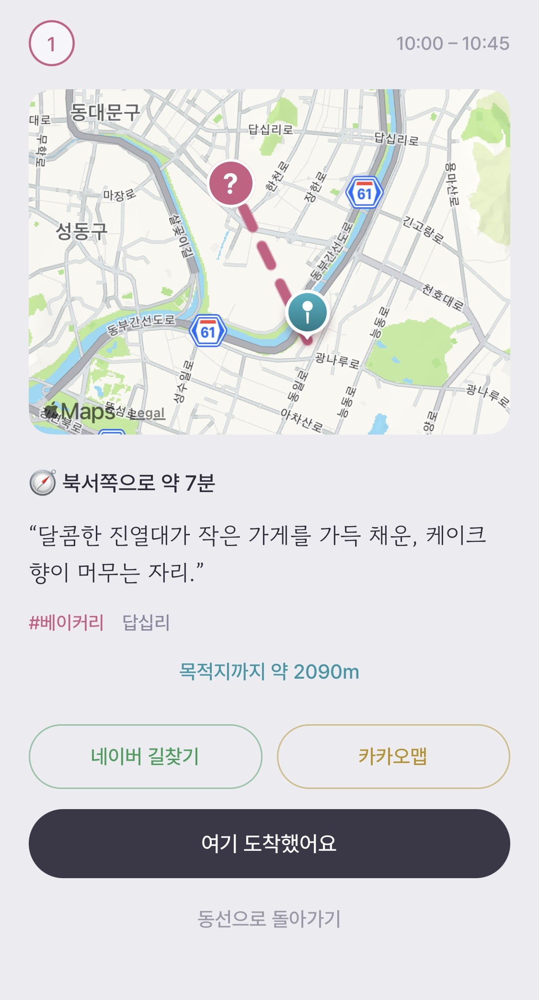
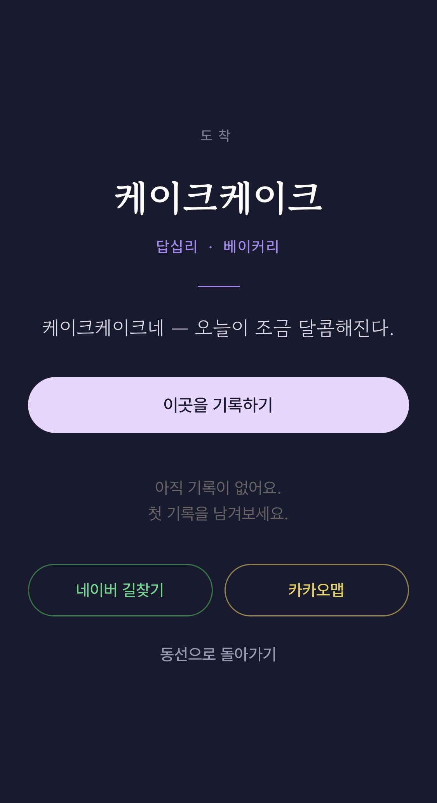

# WanderWise — *Designed Serendipity*

> 목적지의 **이름을 도착 전까지 숨기는** 여행 앱입니다.
> 무드를 고르면 하루 동선을 만들어 드리되, 각 장소는 *이름 없이* 시적인 힌트·방향·시간만 보여 줍니다.
> 그 앞에 실제로 **도착하는 순간** 이름과 이야기가 펼쳐집니다 — 그 reveal이 이 앱의 감정적 핵심입니다.

React Native(Expo) 프론트엔드 레포입니다. 동선 생성은 별도 백엔드(FastAPI + Supabase)가 담당합니다.

---

## 🎬 경험 흐름

```
무드 선택 ──▶ 하루 동선(이름 숨김: 힌트·방향·시간만)
                    │  카드 탭
                    ▼
          접근 화면(지도 + 목적지까지 거리, 익명 ? 핀 · 네이버/카카오 길찾기)
                    │  GPS 반경 100m 진입  /  "여기 도착했어요"
                    ▼
              reveal — 가게 이름 · 이야기 공개 ✨
```

<p align="center">
  
</p>

| 무드 선택 | 동선(이름 숨김) | 접근(길안내) | 도착(reveal) |
|:---:|:---:|:---:|:---:|
|  |  |  |  |

---

## 💡 설계 결정 (이 프로젝트에서 고민한 것)

### 1. "숨기는 건 *이름·정체*일 뿐, *위치*가 아닙니다"
완전히 위치까지 숨기면 도시에서 **걸어서 찾아갈 수 없습니다**(실효성 0). 그래서 경계를 다시 그었습니다:
접근 단계에선 **좌표·경로는 보여 주되**(앱 내 지도에 `showsPointsOfInterest={false}`로 상호 라벨을 꺼서) **이름만** 숨깁니다. 실명·이야기·정확한 핀은 **도착 판정 후**에만 공개합니다. 길찾기는 한국 사용자에 맞춰 **네이버/카카오 딥링크**로 연결합니다(구글 지도는 국내 길찾기가 제한됩니다).

### 2. LLM에 전권을 주지 않고, 역할을 좁혔습니다
처음엔 요청마다 Claude에게 "동선을 통째로 만들어 줘"라고 맡기는 방법도 생각했습니다. 하지만 그러면 없는 장소를 지어내거나(환각) 숨겨야 할 실명이 새어 나올 위험이 컸습니다.
그래서 역할을 나눴습니다. **시적인 힌트·reveal 문구는 미리 생성해 DB에 저장**해 두고, 무드가 들어오면 **① 임베딩으로 후보 장소를 먼저 좁힌 뒤(pgvector 유사도 검색) ② Claude는 그 후보 안에서 선택·순서·시간만 결정**하도록 했습니다. 이름·좌표·이야기는 코드가 DB에서 가져와 합칩니다.
핵심은 **Claude가 후보 밖의 장소를 만들어낼 수 없다는 것**입니다 — 환각과 실명 노출을 *프롬프트 부탁*이 아니라 *구조*로 막았습니다. 응답은 보통 2~4초입니다.

### 3. 무드 임베딩은 미리 계산해 둡니다
무드가 고정 라벨 10개라, 그 **임베딩을 미리 계산해 캐시**해 두었습니다. 매 요청마다 임베딩 API를 부르지 않고, 캐시된 벡터로 바로 Supabase 벡터 검색에 들어갑니다. (자유 입력 무드를 받게 되면 그때만 실시간 임베딩으로 폴백합니다)

### 4. reveal은 덜어낼수록 강해집니다
지도·핀·장식을 얹을수록 클라이맥스가 싸구려가 됐습니다. 결국 **말과 여백**으로 풀었습니다: 헤더를 숨겨 전체화면에 몰입하게 하고, 이름이 떠오르듯 단계적으로 등장시키며(Animated), 길찾기 버튼은 차분한 고스트 스타일로 물러나게 했습니다.

### 5. 흐름 전체를 한 벌의 디자인 언어로 묶었습니다
선택 → 동선 → 접근 → 도착으로 이어지는 화면들이 톤이 제각각이라 흩어져 보였습니다. 그래서 **하나의 팔레트와 타이포그래피**로 정리했습니다: 밝은 라벤더-그레이 배경 위에 **차콜 단색 버튼**을 두고, 장소의 성격은 **카테고리별 색 포인트**(공원=초록, 갤러리=보라, 노포=웜 톤 …)로만 드러냅니다. 한글의 결을 살리려 **고운바탕·고운돋움·Pretendard**를 번들해, 시적 힌트는 바탕체로 또박또박 보여 줍니다. 동선 화면은 왼쪽 **타임라인 축**으로 하루의 흐름이 한눈에 읽히도록 재구성했습니다.
다만 **도착(reveal) 화면만은 첫 진입 화면과 같은 다크 톤으로 남겨** 두었습니다 — 밝은 흐름의 끝에서 어둠으로 전환되는 그 순간이 그 자체로 무대가 되기 때문입니다.

---

## 🏗️ 아키텍처

```
┌─────────────────────────────┐        ┌──────────────────────────────────────┐
│  앱 (이 레포, React Native)   │        │  백엔드 (FastAPI, Railway 배포)         │
│  Expo · expo-router          │ POST   │                                        │
│  expo-location · maps        │ ─────▶ │  /itinerary                            │
│  reveal 연출(Animated)        │ /itin. │   1. 무드 임베딩 (precompute 캐시)       │
└─────────────────────────────┘        │   2. pgvector 유사도 검색 (Supabase)    │
                                        │   3. Claude가 후보 중 선택·순서·시간 결정 │
                                        │      (tool use로 JSON 강제)             │
                                        │   4. 응답: 동선(이름 숨김) + reveal 분리 │
                                        └──────────────────────────────────────┘
       오프라인 파이프라인 (별도):  장소 수집 → 품질 필터(체인·시설 제외, 카테고리 균형)
                                  → Claude로 시적 힌트·reveal 문구 생성
                                  → OpenAI 임베딩 → Supabase(pgvector) 적재
```

**이름 숨김은 서버가 보장합니다** — 응답 `stops[]`에는 힌트·방향·시간만 담기고, 실명·`reveal_text`·좌표는 별도 `reveal` 블록에만 담겨 도착 전까지 클라이언트가 렌더하지 않습니다.

---

## 🛠️ 기술 스택

**프론트엔드** · React Native (Expo), TypeScript, expo-router(파일 기반 라우팅), expo-location(GPS·도착 판정), react-native-maps, Reanimated/Animated, expo-font(고운바탕·고운돋움·Pretendard 번들), 네이버·카카오 지도 딥링크

**백엔드** · FastAPI, Supabase(Postgres + pgvector), Anthropic Claude(요청 시 동선 구성 + 오프라인 콘텐츠 생성), OpenAI 임베딩, Docker · Railway 배포

---

## 🚀 로컬 실행

```bash
npm install
npx expo start          # QR 스캔(Expo Go) 또는 i/a/w
```

- 백엔드 베이스 URL은 [`constants/api.ts`](constants/api.ts)에서 설정하며, 기본값은 배포된 공개 API입니다.
- 동선은 **서울** 데이터 기준이라, 시뮬레이터로 볼 땐 위치를 서울로 지정해야 결과가 나옵니다.
  (iOS Simulator → Features → Location → Custom, 예: `37.5657, 127.0202`)

---

## 📌 주요 화면

| 파일 | 역할 |
|---|---|
| [`app/mood.tsx`](app/mood.tsx) | 무드 선택 |
| [`app/hint.tsx`](app/hint.tsx) | 하루 동선(이름 숨김) 표시 |
| [`app/stop.tsx`](app/stop.tsx) | 접근(지도·거리·길찾기) → 도착 판정 → reveal |

---

## 🔭 다음 / 한계
- 현재는 서울 데이터만 다룹니다 — 도시를 확장하려면 데이터 파이프라인을 다시 실행해야 합니다.
- 동선 구성에 요청당 Claude 호출이 들어가, 응답에 2~4초가 걸립니다. 선택·순서 로직을 코드 기반 플래너로 옮기면 응답을 더 줄일 수 있습니다(향후 개선).
- 접근 단계의 길찾기는 외부 지도 앱으로 핸드오프합니다(앱 내 턴바이턴은 아직 구현하지 않았습니다).
- 자유 입력 무드를 지원하면 임베딩 캐시 미스가 생겨, 라이브 임베딩 비용이 발생합니다.
